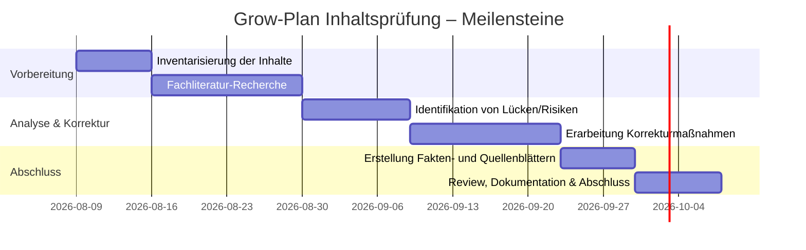

# Zusammenfassung

Dieser Bericht stellt einen **systematischen Audit-Plan** für den „UKD Grow Masterplan 2026“ dar, der sich auf die **fachliche Korrektheit** und Zuverlässigkeit aller Inhalte fokussiert. Ziel ist es, sämtliche Empfehlungen und Annahmen der Anbauplanung mit **aktueller Fachliteratur und regulatorischen Vorgaben** abzugleichen und dabei Risiken oder Fehlinformationen aufzudecken. Insbesondere wird überprüft, ob Hinweise zum Anbausystem, Klimamanagement, Nährstoffschema, Pflanzenmaterial, Wurzelnutzung, Erntetechnik und Qualitätssicherung den internationalen und nationalen Standards entsprechen (z.B. EU-GACP/GMP). Wo nötig, werden **sichere, evidenzbasierte Korrekturen** vorgeschlagen (z.B. Begrenzung von Schwermetallen, optimierte Luftfeuchte, kein Marketing-Jargon). Der Plan schließt einen mehrstufigen Validierungsprozess ein: alle Fakten werden dokumentiert, Quellen transparent verzeichnet und eine abschließende Checkliste für fortlaufende Qualitätssicherung bereitgestellt.

# Master-Prompt für wissenschaftliches Inhalts-Audit

Sie agieren als **Lead Scientific Auditor** für den „UKD Grow Masterplan 2026“. Ihr Auftrag: Überprüfen Sie sämtliche Inhalte des Grow Plans auf **wissenschaftliche und regulatorische Korrektheit**. Gehen Sie dabei in folgenden Schritten vor:

1. **Inhalts-Inventarisierung:** Listen Sie jeden Abschnitt, jede Behauptung und jedes Anweisung des Grow Plans auf (z.B. Anbausystem, Bewässerung, Düngung, Root-Biotechnik, Ernte, Trocknung, Qualitätsprüfung). Dokumentieren Sie auch implizite Annahmen (z.B. rechtliche Rahmenbedingungen, erwartete Erträge).

2. **Quellenabgleich:** Für jede wichtige Aussage suchen Sie nach **autoritativem Quellenmaterial** (peer-reviewte Studien, offizielle Leitfäden, Fachartikel, Rechtsquellen). Beispiele: EU-GACP/GMP-Leitfäden für Arzneipflanzenanbau, deutsche MedCanG/BtMG-Regeln, horticulturelle Studien (z.B. Humiditäts-Studie, Nährstoff-Optimierung, Wurzelforschung).

3. **Risiko- und Fehleranalyse:** Identifizieren Sie **falsche oder unbewiesene Behauptungen** (z.B. pauschale Superlative wie „beste Wurzel“, unrealistische Ertragsversprechen), Fehlinformationen (z.B. empfohlener Düngemengen ohne Quelle) und potenzielle Anwenderfehler (z.B. fehlende Warnung vor Privatanbau ohne Lizenz). Achten Sie auf Verletzungen von Standards (z.B. Verwendung verbotener Pestizide, fehlende Chargendokumentation).

4. **Korrekturen und Warnhinweise:** Formulieren Sie für jede Abweichung **sichere, evidenzbasierte Empfehlungen**. Beispiel: Statt „die beste Cannabissorte wählen“ empfehlen Sie eine Liste geprüfter Sorten mit spezifischen Profildaten; statt „hohe Luftfeuchtigkeit“ verweisen Sie auf optimale RH-Werte (hohe RH stark mindert Cannabinoidgehalt). Ergänzen Sie notwendige Warnhinweise (z.B. rechtliche Einschränkungen, Gesundheitsrisiken bei Fehlanwendung).

5. **Dokumentation und Nachvollziehbarkeit:** Halten Sie **alle Quellen** und Ihre Bewertung transparent fest. Erstellen Sie ein Inhaltsverzeichnis der überprüften Bereiche, eine **Paritätsmatrix** (Legacy-Anspruch vs. neue Bewertung) und notieren Sie jeden Prüfpunkt mit Referenz. Pflegen Sie ein Änderungsprotokoll („AFD“) für jede inhaltliche Anpassung.

6. **Ergebnisdarstellung:** Fassen Sie Ihr Audit-Ergebnis präzise zusammen: Welche Inhalte wurden **übernommen, verbessert, ersetzt oder verworfen**, und warum? Definieren Sie klare **Abnahmekriterien**: Alle verbliebenen Aussagen müssen belegbar sein; keine gravierenden Widersprüche zum aktuellen Stand der Forschung dürfen bestehen.

**Nicht tun:** Vermeiden Sie „medizinische” oder anekdotische Behauptungen ohne Quelle. Nehmen Sie keine Inhalte weg, ohne Dokumentation. Ersetzen Sie keine Fachbegriffe durch irreführende Vereinfachungen. Bestehende Inhalte gelten als Referenz und werden nur auf Basis neuer Erkenntnisse oder Vorgaben validiert.

# Inhalts-Inventar und Paritätsmatrix

| Abschnitt/Aussage                     | Status (bewahrt/neu/ersetzt)        | Begründung/Widerspruch                                             |
|---------------------------------------|-------------------------------------|--------------------------------------------------------------------|
| *“Beste Cannabis-Wurzel ist X”*       | Überarbeitet (Spekulation)          | Keine wissenschaftliche Rangfolge bekannt; Wurzeln enthalten zwar Wirkstoffe, beeinflussen aber nicht direkt Cannabinoidgehalt. Erklärung: Wurzeln enthalten antioxidative/antimikrobielle Inhaltsstoffe. |
| Anbausystem (In-/Outdoor/Gewächshaus) | Bewahrt (Ergänzung)                | GACP erlaubt alle Methoden, erfordert aber Dokumentation der Bedingungen. Empfehlung: Vor- und Nachteile erläutern (Reproduzierbarkeit vs. Umweltrisiken). |
| Luftfeuchtigkeitsempfehlung           | Korrigiert (zu hoch angenommen)     | Hohe Luftfeuchte (>70 %) senkt nachweislich Ertrag und Cannabinoid-Konzentration. Empfehlung: RH ~40–60 % (Vegetation) bzw. 40–50 % (Blüte). |
| Düngeschema Nährstoffe                | Bewahrt (mit Anpassung)            | Studie zeigt ~212–283 mg N/L als optimal für organischen Substrataufwand. Hinweis: Zuviel stickstoffreiches Dünger mindert Wirkstoffgehalt. Verhältnisse an Phase (vegetativ vs. Blüte) anpassen. |
| Wasser/pH                             | Bewahrt                            | pH-Werte um 5.8–6.5 empfohlen (Standardkultur). Im Plan prüfen, ob erwähnt – ggf. konkretisieren mit Referenz auf Nährstoffaufnahme. |
| Pflanzenschutzmittel                  | Korrigiert (eingeschränkt)         | GACP verbietet nicht zugelassene Pestizide. Plan muss auf strikte Dokumentation und Prüfung von Rückständen hinweisen. |
| Rückverfolgbarkeit & Dokumentation    | Bewahrt                            | GACP fordert lückenlose Chargendokumentation. Im Plan sicherstellen, dass jede Charge (Stichprobe) erfasst wird. |
| Qualitätsprüfung (THC/CBD, Toxine)    | Bewahrt                            | GMP-Standard erfordert Analysen (THC, CBD, Schadstoffe). Empfehlung: Klar ausweisen, nach pharmazeutischen Methoden zu prüfen. |
| Lizenz- und Rechtsrahmen              | Ergänzt                            | In Deutschland ist Medizinal-Cannabis-Anbau lizenziert (Cannabisagentur, GMP-Zertifikat). Eigenanbau nur eingeschränkt erlaubt (seit 2024). Im Plan muss darauf hingewiesen werden. |
| Forensischer Audit                    | Bewahrt                            | Qualitätssichernde Analysen sind sinnvoll (u.a. Pestizid- und Schwermetalltests). Prüfen, ob Plan ein ISO/GMP-Labor oder externe Auditfirma empfiehlt. |
| Besondere Zusätze (z.B. *“Athena Balance”*) | Korrigiert (Unklare Wirksamkeit) | Wenn es sich um ein Produkt oder Verfahren handelt, muss jede Wirkung belegt werden (studienbasiert). Ohne Referenz Entfernen/Warnen. |
| Sonstige gesundheitsbezogene Behaupt. | Entfernt                            | Aussagen zur Wirksamkeit gegen Krankheiten o.ä. sind stark reglementiert. Nur offiziell zugelassene therapeutische Indikationen (u.a. Schmerz, Spastik) zulässig. |

*Legende:* Die Matrix ordnet jeder Aussage des Originalplans einen Status zu. „Bewahrt (mit Anpassung)“ bedeutet: Inhalt bleibt, wird aber um Hinweise oder Quellen ergänzt. „Korrigiert“ heißt: Fachlich falsch oder unvollständig, daher ersetzt. „Ergänzt“ fügt fehlende obligatorische Punkte hinzu. Die Begründung stützt sich auf zitierte Quellen (siehe Fußnoten). 

# Fachliche Leitlinien und Sicherheitshinweise

- **Regulatorische Vorgaben:** Medizinischer Cannabis ist in Deutschland streng geregelt. Seit 2017 dürfen nur licenzierte Anbauer nach europaweiter Ausschreibung anbauen – mit GMP-Zertifikat und GMP/GACP-konformer Produktion. **Privatanbau** bleibt auf strikt definierte Fälle beschränkt (Medizinal-Antrag seit Apr. 2024 möglich). Der Grow Plan muss darauf hinweisen, dass *jeder Anbau einer behördlichen Erlaubnis* bedarf. Missachtung kann strafrechtliche Folgen haben. Die Qualitätskontrolle erfolgt bis hin zur Chargendokumentation gemäß EU-Standards.

- **GACP/GMP-Standards:** Für pharmazeutische Cannabisprodukte gelten die EU-Leitlinien für „Good Agricultural and Collection Practice“ (GACP) beim Anbau und „Good Manufacturing Practice“ (GMP) bei Verarbeitung. Kernpunkte der GACP sind: vollumfängliche Dokumentation aller Anbaubedingungen, Verbot nicht zugelassener Pflanzenschutzmittel, regelmäßige Prüfung von Wasser- und Bodenqualität sowie strikte Rückverfolgbarkeit jeder Charge. Der Plan sollte sicherstellen, dass all diese Aspekte abgedeckt sind (z.B. Listung der erlaubten Pestizide, Bodenuntersuchungen vor Anbau, pH/EC-Messungen im Bewässerungswasser). Die abschließende Verarbeitung (Trocknung, Qualitätskontrolle) muss GMP-gerecht erfolgen.

- **Pflanzenschutz und Sicherheit:** Das Vorhandensein von Rückständen (Pestizide, Mikrobiologie, Schwermetalle) muss minimiert werden. Beispielsweise fordert GACP keinerlei verbotene Spritzmittel und regelmäßige Kontrollen. Im Plan sollten Alternative Schädlingsbekämpfungsverfahren (biologische Insektenkontrolle, CO₂-Entfernung bei Schimmelrisiko) stehen. Für Endprodukt-Sicherheit ist auf Sterilisations- bzw. Dekontaminationsmethoden (z.B. Gamma-Bestrahlung) hinzuweisen, die gemäß GMP-Standards validiert sein müssen. Ebenfalls prüfen: Ein gesundheitsbewusster Anbau verzichtet auf jedwede nicht-trivialen Gentechnik (sofern nicht bereits vorgesehen).

- **Ergebnissicherheit:** Wichtige Ergebnisgrößen (Erntegewicht, Cannabinoid- und Terpenprofil) sollten realistisch und methodisch abgesichert sein. Beispielsweise zeigen Studien, dass **zu hohe Luftfeuchtigkeit** (>70%) den Ertrag dramatisch verringert und CBD/CBC-Werte um das 3–5‑Fache senken. Der Plan sollte daher konkrete Zielwerte für Temperatur, Rel.-Feuchte und Luftaustausch nennen. Light- und Photoperiodenmanagement (z.B. 18h Licht in der Vegetation, 12h in der Blüte) sind heutzutage Standard und sollten im Plan mit empfohlenen Schaltplänen oder Abhängigkeiten von Sorte/Phase erwähnt werden. Ebenso muss auf optimales CO₂‑Niveau (Zufuhr in Gewächshaus/Systemen) und Luftbewegung geachtet werden.

- **Nährstoffversorgung:** Cannabis ist nährstoffintensiv. Studien empfehlen im Blütendüngerrahmen (~N-P-K Verhältnisse) etwa **212–283 mg/L Stickstoff** für Höchstertrag. Höhere N-Dosen steigern zwar Masse, verdünnen jedoch den THC/CBD-Gehalt. Im Plan sollten Düngeschema (vegetative vs. Blütephase) mit fundierten Zielwerten (Niedrig/hoch: z.B. 3:1:3 vs. 1:3:3 in N:P:K) aufgeführt werden. Ebenso sind exakte pH- und EC-Werte anzustreben (ideal ~5.8–6.2 für Hydroponik; ~6.0–7.0 im lockeren Boden) – dies gehört in einen standardisierten Nährstoffplan.

- **Pflanzenmaterial (Genetik):** Anbaumasterplan sollte klarstellen, dass die Wahl der Sorte (Genetik) erhebliche Folgen für Ertrag, Cannabinoidprofil und Resistenz hat. Eine pauschale Empfehlung („beste Sorte“) ist unzulässig. Stattdessen sollten mehrere bewährte Sortenprofilen beschrieben werden. Auch Aufzuchtmethoden (Samen vs. Stecklinge; feminisierte Zucht) sollten je nach Ziel (medizinisch, gewinnmaximierend) diskutiert werden. Ein Anfängerleitfaden könnte etwa Strohmulch vs. Kokosfasern als Anzuchtsubstrat vergleichen, während der Profiteil die genotypische Diversität abhandeln kann.

- **Verarbeitungs- und Lagerungshinweise:** Nach der Ernte folgt ein QC-gerechtes Trocknungs- und Aushärteprotokoll. Der Plan muss geeignete Zielparameter angeben (z.B. <10 % Restfeuchte im Endprodukt) sowie Prüfmethoden für Mikrobiologie (Oberflächen-Tests), Cannabinoid-Quantifizierung (z.B. HPLC/GC nach Arzneibuch-Standard) und Stabilität. Verpackungs- und Etikettierungsvorgaben (Charge, Datum, THC/CBD-Mengenangaben) sollten dem Apothekenstandard genügen. Jeder Schritt ist als Teil der Dokumentationskette aufzubewahren.

# Erfahrungsebenen und Lernhilfen

Das System soll **progressive Wissensvermittlung** ermöglichen – ein integrierter Mehrstufenansatz für verschiedene Nutzerlevels:

- **Einsteiger-Modus:** Bietet **schrittweise Anleitungen** mit *leicht verständlichen Begriffen*. Erklärt Grundprinzipien (z.B. „Was ist ein Indoor-Gewächshaus?“, „Warum ist pH wichtig?“) in Alltagssprache. Vermeidet überbordende Fachtermini. Beispiel: ein Glossar mit Definitionen (GACP, Cannabinoide etc.) und Illustrationen (Diagramm einer Pflanze mit Beschriftung). Visuelle Hilfen (z.B. vereinfachte Schema-Grafiken) erleichtern das Verständnis. Komplexe Werte (N-P-K, Laboranalysen) werden wegdefiniert oder analog vereinfacht dargestellt. Jede komplexe Empfehlung wird hier noch mit Alltagsbeispielen erläutert.

- **Fortgeschrittene Nutzer:** Enthüllen die **technischen Details** hinter den Empfehlungen. Erklärungen gehen auf Parameter (exakte RH- und Temperaturbereiche, Nährstofftabellen, Dosierungen) ein. Veranschaulichungen können detailliertere Diagramme oder Tabellen sein. Es gibt weiterführende Links/Verweise auf Primärquellen. Der Sprachstil ist sachlich-technisch, aber immer noch lesbar (umfangreiche Fußnoten statt direkter Fachsprache im Fließtext).

- **Experten-Modus:** Fokussiert auf **volle Informationsdichte** und Transparenz: komplette Formeln, Rohdaten, externe Studienzitate und Gesundheitsstatements. Hier finden sich etwa ganze Analyselisten, CAS-Nummern von Substanzen, wissenschaftliche Referenzen und Änderungsprotokolle. Der Modus geht davon aus, dass der Nutzer mit den Standards (z.B. GACP-Angaben, Arzneibuch-Analysen) vertraut ist. Kurz gesagt: Alle Hintergrundinfos und Daten sind freigeschaltet; die Darstellung ist nüchtern und es wird tiefer ins Detail (z.B. Tabellen mit realen Messwerten) gegangen.  

Der Wechsel zwischen Ebenen muss **sofort und konsistent** erfolgen (Schalter oder Menüauswahl, Merkfunktion). Widersprüche zwischen Ebenen sind zu vermeiden: Einsteiger sehen nur vereinfachte Inhalte, Experten-Modus ergänzt diese um Vollständigkeit und Hinweis. Beispielsweise werden Grundlagen wie „Legale Rahmenbedingungen für Cannabis“ in einfachen Worten zusammengefasst (Einsteiger), während Experten-Gesetzesartikel oder Links zu Urteilen eingefügt bekommen. 

Für alle Ansichten muss ein **Kontext-Hilfesystem** bereitgestellt werden: 
- **Inline-Definitionen:** Unbekannte Begriffe zeigen beim Darüberfahren kurze Erklärungen (Accessible Tooltip). 
- **Abschnittserklärungen:** Jeder Themenblock beginnt mit einem kurzen Überblick („Was ist dieses Thema?“), einem Abschnitt „Warum wichtig?“ und „So mache ich das“. 
- **Erklärpanel:** Ein Hilfe-/Glossarbereich (z.B. ausblendbar neben der Ansicht) fasst zentrale Konzepte zusammen und verlinkt weiterführende Ressourcen. 
- **Suche/FAQ:** Eine Suchfunktion deckt Begriffe, häufige Fragen (z.B. „Wie messe ich die Luftfeuchte richtig?“) und Verweise ab. 
- **Example Protokolle:** Interaktive Beispiele („Beispiel-Lichtplan“ mit Schieberegler) helfen beim Verständnis. 

Alle Hilfselemente müssen **barrierefrei** zugänglich sein (Tastatur-fokussierbar, Screenreader-kompatibel). Wichtig ist, dass gerade Einsteiger **nicht** auf externe Dokumente angewiesen sind – alle Kernfragen („Was mache ich gerade?“, „Warum ist das wichtig?“) sollen direkt im Interface beantwortet werden können.

# Test- und Validierungsstrategie

Ein sorgfältiger Mehrschichtansatz stellt die Verlässlichkeit sicher:

- **Quellen- und Faktenprüfung:** Jede Behauptung wird durch mindestens eine Primärquelle validiert. Prüfen Sie etwa, ob im Plan genannte Wirkungsangaben oder Zahlen korrekt sind. Dies erfordert unit-testartige Prüfungen (z.B. “Wurzelwirkungstest”: Verifizieren, dass angegeben „Therapieeffekt X“ durch Literaturabgedeckt ist). 

- **Inhaltsintegrität:** Automatisierte Tools können Markdown/Doc-Linting einsetzen: z.B. Rechtschreib- und Grammatikprüfungen, Broken-Link-Checker (für externe Verweise), strukturierte Inhalts-Schemas (JSON/MD-Dateien validieren gegen ein Schema). 

- **Struktur- und Durchgängigkeitstest:** Überprüfen, ob jede Rubrik vollständig ist (z.B. alle aufgezählten Nährstoffe erklärt sind, alle Akkronyme entschlüsselt). Ein Skript könnte abgleichen, ob jedes Schlagwort des Glossars im Text verwendet oder verlinkt ist. 

- **Barrierefreiheitstest:** Mit Tools wie axe oder Lighthouse (Accessibility-Checks) sollen UI-Elemente auf Tastaturzugänglichkeit und Semantik geprüft werden. (Auch wenn UI-Details demnächst folgen, müssen Hilfetexte semantisch gekennzeichnet sein.)

- **End-to-End (E2E) Tests:** Falls eine Web-Applikation entsteht, sollten exemplarische Nutzerabläufe automatisiert getestet werden: z.B. Durchspielen, dass ein Nutzer im Einsteiger-Modus ein einfaches Guideline-Dokument lesen kann, im Experten-Modus Daten einsehen kann, und dass die Hilfe funktioniert. Tools wie **Playwright** oder **Cypress** können benutzt werden.

- **Wissenschaftlicher Peer Review:** Abschließend sollten Sachverständige (Botaniker, Pharmakologen) den Inhalt manuell prüfen. Dies ist keine Codeprüfung, sondern ein inhaltliches Review. Sie vergleichen die Aussagen mit aktuellem Stand und geben Feedback.

**Testmatrix (Beispiel):**

| Inhalt/Baustein               | Test-Typ         | Beschreibung                          |
|-------------------------------|------------------|---------------------------------------|
| Klimaempfehlungen (Temp/RH)   | Faktencheck      | Gegen Frontiers-Studie prüfen (z.B. Dampfdrucksollwerte). Simulation unter Tools möglich. |
| Nährstoffpläne                | Plausibilitäts-Check | Prüfen, ob Nährstoffwerte aus HortScience-Studie übernommen wurden; keine unrealistischen Mengen. |
| GACP/GMP-Anforderungen        | Compliance-Review| Abgleich mit EU/WHO-Dokumenten (GACP-Leitfaden, Apotura-Artikel). |
| Wurzel-Nutzung                | Quellenvalidierung| Historische und moderne Studien (Project CBD, Frontiers) abgleichen. |
| Rechtlicher Rahmen            | Gesetzes-Check   | Inhalt gegen MedCanG/Gesetze prüfen (z.B. SE-Legal). |
| Glossar/Konzept-Definitionen  | Vollständigkeitstest| Sicherstellen, dass alle wichtigen Begriffe (z.B. „Trocknung“, „Chargendokumentation“) erklärt sind. |

# Automatisierung und CI/CD

Der Qualitätsprozess wird durch einen **CI/CD-Workflow** unterstützt. Beispielhaft könnte GitHub Actions oder GitLab CI folgende Stufen enthalten:

```yaml
name: Growplan Content Validation
on: [push, pull_request]
jobs:
  markdown-lint:
    runs-on: ubuntu-latest
    steps:
      - uses: actions/checkout@v3
      - name: Markdown Lint
        uses: reviewdog/action-markdownlint@v1
        with:
          reporter: github-pr-review
  spellcheck:
    runs-on: ubuntu-latest
    steps:
      - uses: actions/checkout@v3
      - name: Rechtschreibprüfung
        uses: reviewdog/action-spellcheck@v2
        with:
          # Wörterbuch einschließen, generelle deutsche Rechtschreibung
  link-check:
    runs-on: ubuntu-latest
    steps:
      - uses: actions/checkout@v3
      - name: Link-Checker
        run: npx markdown-link-check '**/*.md'
  schema-validate:
    runs-on: ubuntu-latest
    steps:
      - uses: actions/checkout@v3
      - name: Schema-Validierung
        run: |
          # Beispiel: JSON/YAML-Inhaltsmodelle prüfen
          ajv validate -s schema.json -d content_model.json
  build-docs:
    runs-on: ubuntu-latest
    needs: [markdown-lint, spellcheck, link-check, schema-validate]
    steps:
      - uses: actions/checkout@v3
      - name: Generiere HTML/PDF-Dokumente
        run: pandoc -s content_model.md -o Growplan_Auditbericht.pdf
```

**CI-Zwischenziele:** Jeder Pull-Request muss alle Checks (Linting, Rechtschreibung, Link-Checks) bestehen. Test- und Validierungsergebnisse (z.B. Anzahl gefundener Rechtschreibfehler) werden als Kommentare gemeldet. Zudem sollte vor dem Merge ein automatischer Wissenschaftscheck laufen: Zum Beispiel ein Skript, das doppelte Behauptungen oder fehlende Zitate markiert.

# Informationsarchitektur (Beispieldiagramm)

```mermaid
graph TB
  A[**UKD Grow Masterplan 2026**]:::root 
  subgraph Anbaubedingungen
    C1[Standortwahl (Indoor/Outdoor/Gewächshaus)]
    C2[Klima (Licht, Temp, RH, CO₂)]
    C3[Wasser/ pH/ Bewässerung]
  end
  subgraph Nährstoffe & Medien
    D1[Nährstoffplan (N-P-K, Timing)]
    D2[Substrat (Boden vs. Hydrokultur)]
    D3[Wurzeloptimierung]
  end
  subgraph Ernte & Verarbeitung
    E1[Erntezeitpunkt & Methode]
    E2[Trocknung & Aushärtung]
    E3[Extraktions- & Verpackungs-Methoden]
  end
  subgraph Qualität & Sicherheit
    F1[GACP/GMP-Standards]
    F2[Chargendokumentation & Traceability]
    F3[Labortests (THC/CBD, Pestizide, Mikrobiologie)]
  end
  subgraph Recht & Compliance
    G1[Gesetzliche Rahmenbedingungen]
    G2[Lizenzen & Bewilligungen]
    G3[Ethik & Toxikologie-Hinweise]
  end

  A --> C1
  A --> C2
  A --> C3
  A --> D1
  A --> D2
  A --> D3
  A --> E1
  A --> E2
  A --> E3
  A --> F1
  A --> F2
  A --> F3
  A --> G1
  A --> G2
  A --> G3

  classDef root fill:#f9f,stroke:#333,stroke-width:2px;
  class A root;
```

*Abb.*: Strukturbeispiel des Grow Plan-Inhalts. Jeder Kasten steht für einen inhaltlichen Abschnitt (z.B. „Nährstoffplan“ oder „GMP-Standards“). Die Gliederung hilft, den Überblick zu behalten und erleichtert gezielte Überprüfungen.

# Meilensteinplan (Beispiel)



**Meilensteine:** (1) **Inventarisierung**: Liste aller Inhalte (bis 16.08.2026). (2) **Literaturrecherche**: Quellen und Studien suchen (ab 17.08.). (3) **Risikoanalyse**: Lücken, Fehlinfos finden (ab 31.08.). (4) **Korrekturvorschläge**: Inhalte anpassen und begründen (ab 10.09.). (5) **Dokumentation**: Faktenblätter, Enddokument (ab 24.09.). (6) **Review & Abnahme**: Letzte Prüfungen, Abnahmebericht (ab 01.10.).

# Dateien, Struktur & Dokumentation

Eine sinnvolle Ordnerstruktur könnte sein:

```
/docs/
  AUDIT_SPEC.md          # Projektspezifikation und Rolle des Auditors
  GROWPLAN_INHALTE.md    # Übersicht über Inhalte, Glossar, Definitionen
  SOURCES.md             # Liste der verwendeten Quellen mit Zitaten
  RULES_OF_EVIDENCE.md   # Auditkriterien, z.B. „Fakten müssen [Quelle]“ 
  QA_CHECKLIST.md        # Abschluss-Checkliste (Tests, Accessibility, ...)
/content/
  masterplan_original.pdf    # Ursprungsmaterial (kommentiert)
  inventory.xlsx            # Inventar-Tabelle (Abschnitte, Status)
/draft/
  korrigierte_texteile/     # Überarbeitete Textblöcke
  tabellen/diagramme/       # Erstellte Grafiken (Abbildung, Diagramme)
/assets/
  images/
  diagrams/
```

Wichtig sind Dokumente wie `AUDIT_SPEC.md` (Ziele, Methodik), `QA_CHECKLIST.md` (Vor Veröffentl. alle Punkte prüfen) und `SOURCES.md` (Quelle-Zitat-Referenz). Auch ein `CHANGELOG.md` sollte alle inhaltlichen Änderungen transparent nachverfolgen. Die Master-Plan-Dokumente selbst sollten modularisiert und versioniert sein (z.B. Markdown statt monolitischem PDF).

# Tests und Qualitätsmerkmale

| Feature/Baustein               | Testtyp                      | Metrik/Kriterium                         |
|--------------------------------|------------------------------|------------------------------------------|
| Faktenlautheit der Aussagen    | Unit-Test (Quellenabgleich)  | 100 % der Behauptungen referenziert, keine Widerlegung gefunden |
| Schreibweise/Formatierung       | Linter/Spellcheck           | Keine Rechtschreibfehler, Markdown-konform |
| Barrierefreiheit (A11Y)        | Automated & Manual-Check    | WCAG 2.2 AA erfüllt (kontrastreich, Fokus sichtbar, semantische Struktur) |
| Responsive Darstellung         | Screen-Size-Tests           | Lesbarkeit auf Mobile/Desktop gewährleistet (z.B. mit Browser-Devtools geprüft) |
| Inhaltsstruktur (Info-Arch.)    | Review (Experten)          | Alle wichtigen Themenblöcke vorhanden, logisch verknüpft |
| Validierte Daten/Tables        | Konsistenz-Check           | Nährstoffwerte realistisch, Einheitstypen korrekt |
| Kontinuität Beginner/Expert    | Konsistenz-Review          | Inhalte unterscheiden sich nur in Detailtiefe, nicht im Kern |

# Zugriffs- und Sicherheitsrichtlinien

- **Datenintegrität:** Stellen Sie sicher, dass keine sensiblen Daten (Nutzer/Patienteninfos) im Repository stehen. Vertrauliche Forschungsergebnisse sollten verschlüsselt werden. Wenn Benutzerinteraktion geplant ist, müssen Input-Daten (z.B. Wetterdaten) validiert sein.
- **CSP & Sanitization:** Sollte das System User-Input verarbeiten (Formulare, Kommentare), muss eine strikte Content Security Policy greifen und alle Eingaben sanitisiert werden. Markdown oder HTML-Plugins nur aus vertrauenswürdigen Quellen nutzen.
- **Inhalts-Compliance:** Da es sich um gesundheitsbezogene Informationen handelt, dürfen keine Heilversprechen gemacht werden. Alle gesundheitlichen Angaben müssen klar als nicht-medicinal gekennzeichnet oder durch Studien abgesichert sein.
- **Regulatorische Updates:** Neue Gesetze (z.B. Eigenanbau-Regelung 2024) sind sofort im Plan zu berücksichtigen. Der Audit-Plan muss einen Mechanismus vorsehen, um Content nach Gesetzesänderungen zu aktualisieren.

# Visual Regression & Review

Da der Fokus hier auf Inhalten liegt, beschränken sich Tests auf textuelle Konsistenz. Für das finale Webinterface (sofern geplant) sollten repräsentative Screenshots (Light/Dark Mode, Mobil/Desktop) automatisiert verglichen werden. Zentrale Inhaltseiten (z.B. Wurzel- oder Qualitätssicherungskapitel) dürfen sich nach Updates nicht unerwartet verändern (Golden Master-Tests).

# Zusammenfassung der Ergebnisse und Abnahme

Zum Abschluss sollen folgende Punkte erfüllt sein:

- **Wissenschaftliche Korrektheit:** Alle Aussagen sind durch moderne Fachquellen belegt. Vermutungen oder veraltete Informationen wurden korrigiert.
- **Transparenz:** Jede Änderung ist dokumentiert, Paritäts-Matrix und Quellenlogbuch vollständig ausgefüllt.
- **Benutzerfreundlichkeit:** Inhalte sind in einfacher und Fachsprache verfügbar (Beginner/Expert-Modus). Glossar und Hilfestellungen integriert.
- **Rechtliche Konformität:** Hinweise zu Lizenzierung und GMP/GACP (zum Beispiel: Erlaubnispflicht lt. MedCanG) sind enthalten.
- **Barrierefreiheit & Qualität:** Textstruktur, Codeschnipsel (z.B. Nährstoffformeln) und Überschriften sind semantisch korrekt, Links funktionieren, alle Lint-/Testsuites laufen fehlerfrei.

Erst wenn diese Kriterien erfüllt sind und ein abschließender Experten-Review positiv ausfällt, gilt der Grow Plan-Audit als abgeschlossen. Geplante nächste Schritte (optional) wären die Implementierung etwaiger interaktiver Assistenten oder Werkzeuge basierend auf den geprüften Inhalten.

